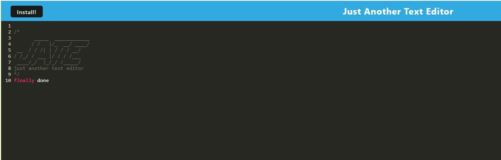

# Text Editor
PWA text editor

## Description

The purpose of this project was to create a text editor using PWA (Progressive Web Application) framework where a user can create notes or code snippets with or without an internet connection and retrieve them for later use.

## Usage

The application is a text editor that saves the user input to a database it creates on IndexDB.  Application contains both put and get functionality.  When a user enters content and then clicks off the DOM window, the user input will be saved to and IndexDB database.  When a user closes and reopens the application, the application will display the previously saved data.  A user can also install the application on a local machine following the instructions in the Installation section of this README.

## Installation

A user can install the application to their local machine by clicking on the "Install" button in the upper left hand corner of the application.

## Credits

N/A

## License

Please refer to the LICENSE in the repo.